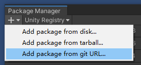

# JackFrame 简介
```
根目录: Assets/com.jackwithtea.jackframe/

>> 独立(低层)程序集 <<
【Core】
目录: Runtime/Independence/JackFrame
程序集: JackFrame.Runtime.dll  
功能: C# 标准库扩展 / 标准类 / 工具类 / Unity 标准库扩展 / Unity UI框架  

【Anymotion】
目录: Runtime/Independence/Anymotion
程序集: JackFrame.Anymotion.dll
功能: 能在任意动画片段之间平滑过渡，替代Animator与AnimatorOverride，亦可从Animator生成Anymotion需要的Graph。
实现方式: 使用 Unity Playable(更底层的API) 

【JackAST】  
目录: Runtime/Independence/JackAST
程序集: JackAST.Runtime.dll  
功能: 元编程，通过代码修改代码
实现方式: 使用 Roslyn 代为底层支持

【BufferIO】
目录: Runtime/Independence/BufferIO
程序集: JackFrame.BufferIO
功能: 二进制序列化/反序列化，例如将 int 序列化成 byte[4]
实现方式: 基础的位运算操作

>> 中层程序集 <<
【JackBuffer】  
目录: Runtime/JackBuffer
程序集: JackBuffer.Runtime  
依赖: JackFrame.AST / JackFrame.BufferIO
功能: 自动生成代码工具，将一个数据结构类(或结构体)生成 ToBytes 与 FromBytes 方法
实现方式: 利用 AST 读取代码文本，利用 BufferIO 进行序列化与反序列化

>> 高层程序集 <<
【NetworkWeaver.Tcp】
目录: Runtime/JackNetworkWeaver/Tcp
程序集: JackFrame.NetworkWeaver.Tcp
依赖: JackFrame.Runtime / JackBuffer / Telepathy
功能: 集成 TCP 网络通信 + 消息序列化
实现方式: Telepathy 作为 TCP 通道，JackBuffer 作为序列化协议

>> 工具程序集 <<
【EditorTool】  
目录: Editor
程序集: JackFrame.EditorTool.dll  
功能: 脏脚本编译工具 / CSProj清理与再生成工具 / 图片切割导出工具  
```

# 环境
支持Unity 2019.4.x ~ 2021.3.x

# Unity PackageManager(UPM) 使用方式
#### 第一步:  
打开 Unity PackageManager, 并点击"Add package from git URL"  
  

#### 第二步:  
复制以下url, 然后点Add, UPM就会自动加载了  
ssh://git@github.com/chenwansal/JackFrame.git?path=/Assets/com.jackwithtea.jackframe#develop
  

#### 注
ssh://git@github.com/chenwansal/JackFrame.git?path=/Assets/com.jackwithtea.jackframe#develop  
\#develop 可改为 #1.1.0, 即可加载对应的版本

# 依赖关系 / Dependancies

