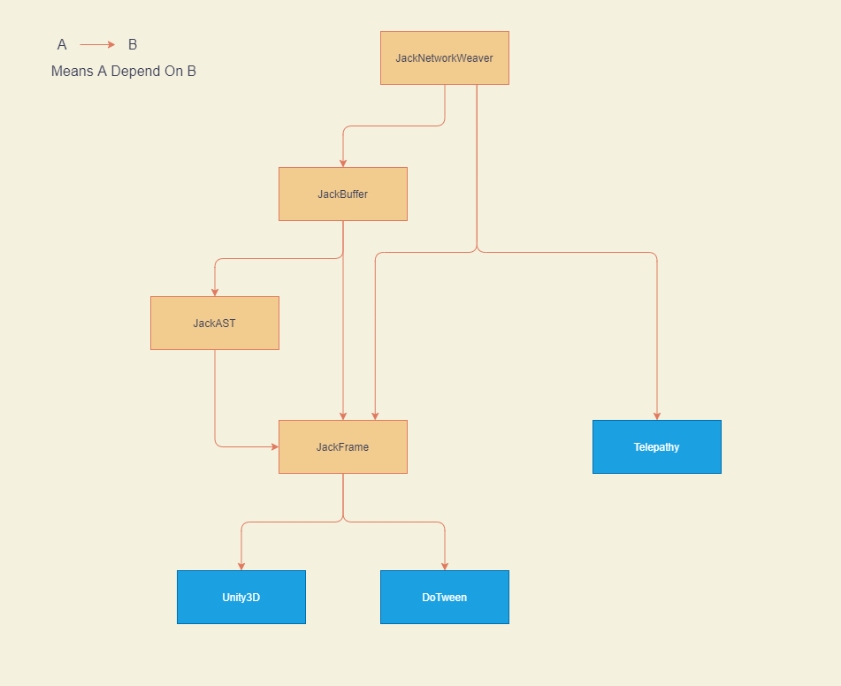

# JackFrame 简介
```
【JackFrame.Core】
程序集: JackFrame.Runtime.dll
功能: C#标准库扩展 / C#标准类 / Unity标准库扩展 / Unity UI框架

【JackFrame.EditorTool】
程序集: JackFrame.EditorTool.dll
功能: 脏脚本编译工具 / CSProj清理与再生成工具 / 图片切割导出工具

【JackAST】
程序集: JackAST.Runtime.dll
功能: 集成 Roslyn 的代码生成工具

【JackBuffer】
程序集: JackBuffer.Runtime
功能: 二进制序列化协议, 自动生成代码, C# 友好(不像某歌buf对C#不友好)
```

# 环境
支持Unity 2019.4.x ~ 2021.2.x

# Unity PackageManager(UPM) 使用方式
#### 第一步:  
打开 Unity PackageManager, 并点击"Add package from git URL"  
  

#### 第二步:  
复制以下url, 然后点Add, UPM就会自动加载了  
ssh://git@github.com/chenwansal/JackFrame.git?path=/Assets/com.jackwithtea.jackframe#master
  

#### 注
ssh://git@github.com/chenwansal/JackFrame.git?path=/Assets/com.jackwithtea.jackframe#master  
\#master 可改为 #1.1.0, 即可加载对应的版本

# 依赖关系 / Dependancies
